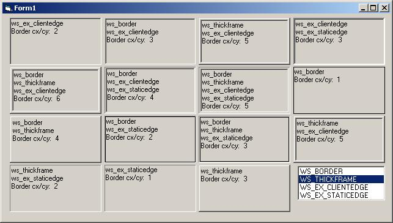



## FYI: Window Border Styles

### Description

While back I posted something like: 2 new borders for your picture boxes. Well how about 13 more? Trying to get a handle on the pixel measurement of borders, I was sometimes off by a pixel & couldn't figure out why. You know 1+3 should = 4, but interesting 'nuf thickframe(3)+staticedge(1)=2 and not 4. Anyway, if you wanted to know...
 
### More Info
 

             |
---                |---
**Submitted On**   |2005-03-01 14:56:02
**By**             |[LaVolpe](https://github.com/Planet-Source-Code/PSCIndex/blob/master/ByAuthor/lavolpe.md)
**Level**          |Intermediate
**User Rating**    |5.0 (80 globes from 16 users)
**Compatibility**  |VB 6\.0
**Category**       |[Graphics](https://github.com/Planet-Source-Code/PSCIndex/blob/master/ByCategory/graphics__1-46.md)
**World**          |[Visual Basic](https://github.com/Planet-Source-Code/PSCIndex/blob/master/ByWorld/visual-basic.md)
**Archive File**   |[FYI\_\_Windo185940312005\.zip](https://github.com/Planet-Source-Code/lavolpe-fyi-window-border-styles__1-59226/archive/master.zip)

